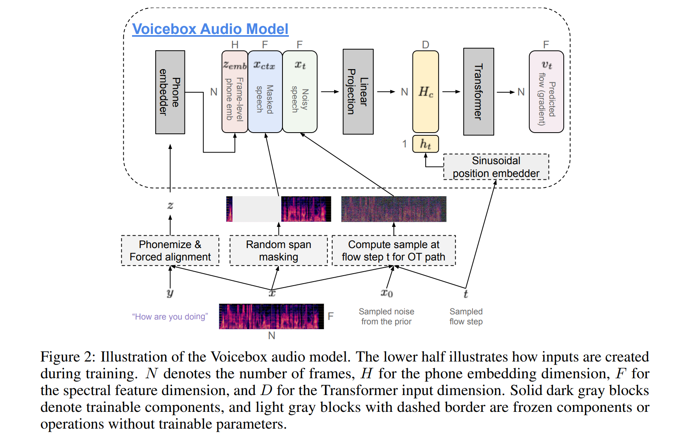

# E2-TTS


## Introduction

[E2 TTS](https://arxiv.org/abs/2406.18009v1) is a fully non-autoregressive zero-shot text-to-speech, which learns alignments automatically, simplifies TTS system.


This recipe is an unofficial PyTorch implementation of E2 TTS. [DiT](https://arxiv.org/abs/2212.09748) framework is adopted here. Training is modeled as a speech infilling task similar to [Voicebox](https://arxiv.org/abs/2306.15687): 

<details>
<summary><strong>Environments</strong></summary>

- Python 3.8
- Pytorch 2.0.1
- egrecho
- vocos
- torchdiffeq
</details>


**Supports**:

- [x]  [DiT](https://arxiv.org/abs/2212.09748) framework
- [x]  TTS Demo
- [x]  Multi-GPU traning based on [Lightning](https://github.com/Lightning-AI/pytorch-lightning) trainer
- [ ]  Pretrained model
- [ ]  Automatic metrics (SV + ASR)


## Contents

- [E2-TTS](#e2-tts)
  - [Introduction](#introduction)
  - [Contents](#contents)
  - [Installation](#installation)
  - [QuickStart](#quickstart)
  - [Main programs](#main-programs)
  - [Results](#results)
  - [Prepare data](#prepare-data)
  - [Train model](#train-model)
  - [Reference](#reference)


<span id='Installation'></span>
## Installation
We assume you have already installed cuda PyTorch and Egrecho. Next, you should install additional requirements specified in the ``requirements.txt`` file provided by this recipe if necessary.
## QuickStart
Pretrained weights trained on libritts is available at modelscope [dummy-link](), download that repo and tts a demo as:
<!-- ```shell
egrecho tts-ve -c=config/tts_valle_pretrained.yaml demo
``` -->
Type `egrecho tts-e2 -h` for cli usage.
<span id='maincodes'></span>
## Main programs

+ **local**: Holds some local scripts, like data preparation.
+ **egrecho_inner**: Inner local python package, contains codes for training/evaluation.
+ **config**: json/yaml configuration files
+ **shell scripts**:
  ```bash
  # prepare => train => eval
  bash prepare_libritts.sh
  bash train.sh
  ```
<span id='results'></span>
## Results

* TODO

*Conducted by Dexin Liao (2024-08)*
<span id='prepdata'></span>
## Prepare data

[Lhotse](https://github.com/lhotse-speech/lhotse) is a excellent project for speech-related data preparation. At last, the data format should be as jsonlines, meaning that each line is a JSON data.

Here provides ``prepare_libritts.sh``:
<details>
<summary>Prepare datasets</summary>

* Download & prepare manifests
* Prepare simple cuts for tts.
* Prepare testset for acoustic evaluation.
```bash
tree exp/egs/libritts_simple
# manifests
exp/egs/libritts_simple
├── cuts_dev.jsonl.gz
├── cuts_dev-other.jsonl.gz
├── cuts_test.jsonl.gz
├── cuts_test-other.jsonl.gz
├── cuts_train.jsonl.gz
├── egs_test_prompt_200.jsonl
└── tokens.txt
```

```shell
zcat exp/egs/libritts_simple/cuts_dev.jsonl.gz | head -n 1
```
```python
{"id": "6241_66616_000004_000000-0", "start": 0, "duration": 0.82, "channel": 0, ...}
```
```shell
cat exp/egs/libritts_simple/egs_test_prompt_200.jsonl | head -n 1
```
```python
{"id": "7021_79730_000062_000000", "prompt_audio": "data/prompt_test/libritts/audio/7021/702/7021_79730_000061_000000.wav", "prompt_text": "\"Why can't you take me?\" asks Mary.", "audio": "data/prompt_test/libritts/audio/7021/702/7021_79730_000062_000000.wav", "text": "\"I can not tell you why, now,\" replies the mother, \"but perhaps I will explain it to you after I come home."}
```
Lets check the statics of dataset:
```shell
python ./local/display_manifests.py exp/egs/libritts_simple/cuts_train.jsonl.gz
```
```txt
╒═══════════════════════════╤═══════════╕
│ Cuts count:               │ 354779    │
├───────────────────────────┼───────────┤
│ Total duration (hh:mm:ss) │ 555:09:36 │
├───────────────────────────┼───────────┤
│ mean                      │ 5.6       │
├───────────────────────────┼───────────┤
│ std                       │ 4.5       │
├───────────────────────────┼───────────┤
│ min                       │ 0.1       │
├───────────────────────────┼───────────┤
│ 25%                       │ 2.3       │
├───────────────────────────┼───────────┤
│ 50%                       │ 4.3       │
├───────────────────────────┼───────────┤
│ 75%                       │ 7.6       │
├───────────────────────────┼───────────┤
│ 99%                       │ 20.9      │
├───────────────────────────┼───────────┤
│ 99.5%                     │ 23.1      │
├───────────────────────────┼───────────┤
│ 99.9%                     │ 27.4      │
├───────────────────────────┼───────────┤
│ max                       │ 43.9      │
├───────────────────────────┼───────────┤
│ Recordings available:     │ 354779    │
├───────────────────────────┼───────────┤
│ Features available:       │ 0         │
├───────────────────────────┼───────────┤
│ Supervisions available:   │ 354779    │
╘═══════════════════════════╧═══════════╛
```
</details>

## Train model

We are ready to train our model. In ``train.sh``, ``--stage 0 --endstage 1`` is training and ``--stage 2 --endstage 2`` infers a demo.
<!-- In addition, the ``eval_acoustic.sh`` tts the testset and compute its spk score and wer. -->
The related python scripts are in ``egrecho_inner``:
+ ``pl_train.py:`` Train ar/nar submodel.
+ ``tts_e2.py``: Inference/demo testset.
<!-- + ``eval_wer.py``: Computes wer via whisper. -->

It is recommended to use configuration yaml to better control your experiments：``egrecho train-e2tts -c=config/e2tts.yaml [overwrite opts]``. Type ``egrecho train-e2tts --print_config > raw.yaml`` to get a raw yaml to revise.


<!-- <span id='tensorboard'></span>
<details>
<summary>Tensorboard curve 📉</summary>


</details>

After training, ``eval_acoustic.sh`` requires pretrained speaker model and whisper. Modify ``config/tts_ve.yaml`` to select checkpoints for evaluation, finally exports the desired model:
```shell
egrecho tts-ve -c=config/tts_ve.yaml export
tree exp/valle/valle-final
# exp/valle/valle-final
# ├── config
# │   ├── model_config.yaml
# │   ├── tokenizer_config.yaml
# │   ├── tokens.txt
# │   └── types.yaml
# └── model_weight.ckpt
``` -->

<span id='ref'></span>
## Reference

```bibtex
@inproceedings{Eskimez2024E2TE,
    title   = {E2 TTS: Embarrassingly Easy Fully Non-Autoregressive Zero-Shot TTS},
    author  = {Sefik Emre Eskimez and Xiaofei Wang and Manthan Thakker and Canrun Li and Chung-Hsien Tsai and Zhen Xiao and Hemin Yang and Zirun Zhu and Min Tang and Xu Tan and Yanqing Liu and Sheng Zhao and Naoyuki Kanda},
    year    = {2024},
    url     = {https://api.semanticscholar.org/CorpusID:270738197}
}
```
```bibtex
@article{Le2023VoiceboxTM,
    title   = {Voicebox: Text-Guided Multilingual Universal Speech Generation at Scale},
    author  = {Matt Le and Apoorv Vyas and Bowen Shi and Brian Karrer and Leda Sari and Rashel Moritz and Mary Williamson and Vimal Manohar and Yossi Adi and Jay Mahadeokar and Wei-Ning Hsu},
    journal = {ArXiv},
    year    = {2023},
    volume  = {abs/2306.15687},
    url     = {https://api.semanticscholar.org/CorpusID:259275061}
}
```
