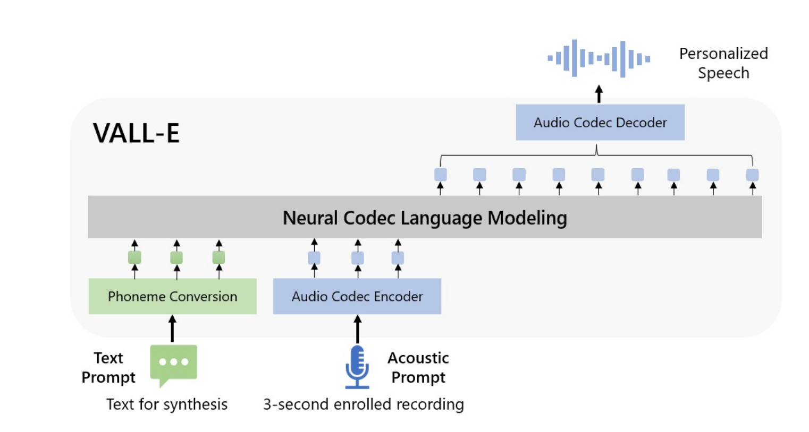
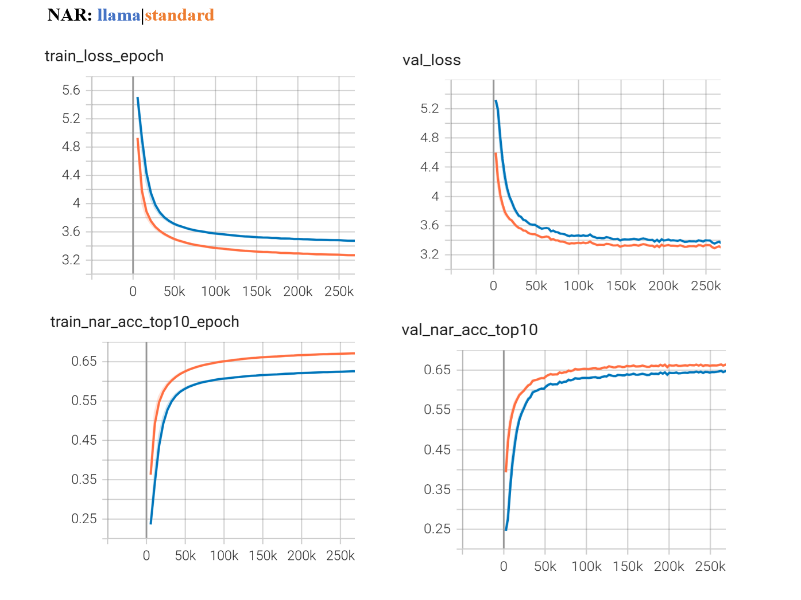

# VALL-E


## Introduction

[VALL-E](https://arxiv.org/abs/2301.02111) is a pioneering GPT-like TTS framework, which treats TTS as a language model (LM) task with audio codec codes (e.g., [EnCodec](https://github.com/facebookresearch/encodec)) as an intermediate
representation to replace the traditional mel spectrogram. The LM predicts output tokens of the first quantizer, while tokens of the remaining quantizers are predicted by a non-autoregressive model one by one.


This recipe means to enhance the understanding of speech language models. It is an unofficial PyTorch implementation of VALL-E, which can serve as a baseline for further refinements and advancements.


<details>
<summary><strong>Environments</strong></summary>

- Python 3.8
- Pytorch 2.0.1
- egrecho
- encodec
- phonemizer
</details>

**Highlights**:
- [x]  Llama framework upgraded
- [x]  TTS Demo & Inference
- [x]  Multi-GPU traning based on [Lightning](https://github.com/Lightning-AI/pytorch-lightning) trainer
- [x]  Automatic metrics (SV + ASR)
- [ ]  Webui


## Contents

- [VALL-E](#vall-e)
  - [Introduction](#introduction)
  - [Contents](#contents)
  - [Installation](#installation)
  - [QuickStart](#quickstart)
  - [Main programs](#main-programs)
  - [Results](#results)
  - [Prepare data](#prepare-data)
  - [Train model](#train-model)
  - [Reference](#reference)


<span id='Installation'></span>
## Installation
We assume you have already installed cuda PyTorch and Egrecho. Next, you should install additional requirements specified in the ``requirements.txt`` file provided by this recipe if necessary.
## QuickStart
Pretrained weights trained on libritts is available at modelscope [link](https://modelscope.cn/models/wangers/vall-e), download that repo and tts a demo as:
```shell
egrecho tts-ve -c=config/tts_valle_pretrained.yaml demo
```
Type `egrecho tts-ve -h` for cli usage.
<span id='maincodes'></span>
## Main programs

+ **local**: Holds some local scripts, like data preparation.
+ **egrecho_inner**: Inner local python package, contains codes for training/evaluation.
+ **config**: json/yaml configuration files
+ **shell scripts**:
  ```bash
  # prepare => train => eval
  bash prepare_libritts.sh
  bash train.sh
  bash eval_acoustic.sh
  ```
<span id='results'></span>
## Results
The Vall-E consists of AR and NAR submodels, totaling approximately 371M parameters, as referenced in the paper's configuration.
* Test data are sampled from Libritts test-clean with audio lengths between 4 and 10 seconds and prepended prompts ranging from 2 to 3 seconds. Resulting a total of **180** test pairs :ok_hand:.
* SPK is the cosine similarity score of the tts audio and its prompt. The speaker model is [CAM++](https://arxiv.org/abs/2303.00332) trained on voceleb2. Please refer to recipe :wink: [voxcelebSRC](https://github.com/wangers/subtools2/blob/master/recipes/voxcelebSRC/README.md).
* WER is the word error rate evaluated by [openai/whisper-large-v3](https://huggingface.co/openai/whisper-large-v3) model. Requires Hugging Face 🤗 [Transformers](https://github.com/huggingface/transformers).
* Llama 🦙 components replacement including:
  * LayerNorm => RMSNorm
  * Sinusoidal PE => Rotary PE
  * FFN => [Gated FFN](https://arxiv.org/pdf/2002.05202)
  * Bias True => False

| model | SPK <b><span style="color:green">↑</span></b> | WER (I, D, S) <b><span style="color:green">↓</span></b> |
| :-----  | :--------: | :------- |
| Vall-E | 0.445    | 20.54 (2.75, 3.54, 14.24)   |
| Vall-E-llama  | 0.555  | **6.58** (0.78, 1.30, 4.49)   |
| Valle-llama-refine  | 0.560  | **3.39** (0.55, 0.92, 1.91)   |


<details>
<summary><strong>NOTE</strong></summary>

> 1. The WER is primarily influenced by the performance of the AR submodel. Meanwhile, the NAR submodel affects the speaker similarity a lot.
> 2. The Vall-E-Llama converges quickly and easy to train. In contrast, the standard Vall-E converges slowly. For example, the AR submodel was trained for 20 epochs, and the NAR submodel for 35 epochs. I encountered a bot-like result in the TTS audio, which confused the whisper and resulted in a high WER.
> 3. The comparison between the standard and Llama-style models was performed using identical strategies, as outlined in the ``train_ar.yaml``/``train_nar.yaml`` configuration files, the tensorboard logs can be view [here](#tensorboard). Additionally, the ``refine`` version was trained for an extended number of total steps, following the ``trian*_llama.yaml`` configuration.
</details>

*Conducted by Dexin Liao (2024-07)*
<span id='prepdata'></span>
## Prepare data

[Lhotse](https://github.com/lhotse-speech/lhotse) is a excellent project for speech-related data preparation. At last, the data format should be as jsonlines, meaning that each line is a JSON data.

Here provides ``prepare_libritts.sh``:
<details>
<summary>Prepare datasets</summary>

* Download & prepare manifests
* Encode audio codes based on [EnCodec](https://github.com/facebookresearch/encodec).
* Tokenize text via espeak (piper-phonemize).
* Prepare testset for acoustic evaluation.
```bash
tree exp/egs/libritts/
# manifests
exp/egs/libritts/
├── cuts_dev.jsonl.gz
├── cuts_dev-other.jsonl.gz
├── cuts_test.jsonl.gz
├── cuts_test-other.jsonl.gz
├── cuts_train.jsonl.gz
├── egs_test_prompt_200.jsonl
└── tokens.txt
```

```shell
zcat exp/egs/libritts/cuts_dev.jsonl.gz | head -n 1-n
```
```python
{"id": "6241_66616_000004_000000-0", "start": 0, "duration": 0.82, "channel": 0, ...}
```
```shell
cat exp/egs/libritts/egs_test_prompt_200.jsonl | head -n 1
```
```python
{"id": "7021_79730_000062_000000", "prompt_audio": "data/prompt_test/libritts/audio/7021/702/7021_79730_000061_000000.wav", "prompt_text": "\"Why can't you take me?\" asks Mary.", "audio": "data/prompt_test/libritts/audio/7021/702/7021_79730_000062_000000.wav", "text": "\"I can not tell you why, now,\" replies the mother, \"but perhaps I will explain it to you after I come home."}
```
Lets check the statics of dataset:
```shell
python ./local/display_manifests.py exp/egs/libritts/cuts_train.jsonl.gz
```
```txt
╒═══════════════════════════╤═══════════╕
│ Cuts count:               │ 354779    │
├───────────────────────────┼───────────┤
│ Total duration (hh:mm:ss) │ 555:09:36 │
├───────────────────────────┼───────────┤
│ mean                      │ 5.6       │
├───────────────────────────┼───────────┤
│ std                       │ 4.5       │
├───────────────────────────┼───────────┤
│ min                       │ 0.1       │
├───────────────────────────┼───────────┤
│ 25%                       │ 2.3       │
├───────────────────────────┼───────────┤
│ 50%                       │ 4.3       │
├───────────────────────────┼───────────┤
│ 75%                       │ 7.6       │
├───────────────────────────┼───────────┤
│ 99%                       │ 20.9      │
├───────────────────────────┼───────────┤
│ 99.5%                     │ 23.1      │
├───────────────────────────┼───────────┤
│ 99.9%                     │ 27.4      │
├───────────────────────────┼───────────┤
│ max                       │ 43.9      │
├───────────────────────────┼───────────┤
│ Recordings available:     │ 354779    │
├───────────────────────────┼───────────┤
│ Features available:       │ 354779    │
├───────────────────────────┼───────────┤
│ Supervisions available:   │ 354779    │
╘═══════════════════════════╧═══════════╛
```
</details>

## Train model

We are ready to train our model. In ``train.sh``, ``--stage 0 --stop_stage 1`` is training and ``--stage 2 --stop_stage 2`` infers a demo. In addition, the ``eval_acoustic.sh`` tts the testset and compute its spk score and wer.
The related python scripts are in ``egrecho_inner``:
+ ``pl_train.py:`` Train ar/nar submodel.
+ ``tts_valle.py``: Inference/demo testset.
+ ``eval_wer.py``: Computes wer via whisper.

It is recommended to use configuration yaml to better control your experiments：``egrecho train-valle -c=config/train_ar_llama.yaml [overwrite opts]``. Type ``egrecho train-valle --print_config > raw.yaml`` to get a raw yaml to revise.
```shell
egrecho train-valle -c=config/train_ar_llama.yaml
# parallel in another process
egrecho train-valle -c=config/train_nar_llama.yaml
```

<span id='tensorboard'></span>
<details>
<summary>Tensorboard curve 📉</summary>


</details>

After training, ``eval_acoustic.sh`` requires pretrained speaker model and whisper. Modify ``config/tts_ve.yaml`` to select checkpoints for evaluation, finally exports the desired model:
```shell
egrecho tts-ve -c=config/tts_ve.yaml export
tree exp/valle/valle-final
# exp/valle/valle-final
# ├── config
# │   ├── model_config.yaml
# │   ├── tokenizer_config.yaml
# │   ├── tokens.txt
# │   └── types.yaml
# └── model_weight.ckpt
```

<span id='ref'></span>
## Reference

1. https://github.com/lifeiteng/vall-e
2. https://github.com/meta-llama/llama3
3. https://github.com/huggingface/distil-whisper
4. https://github.com/openai/whisper
