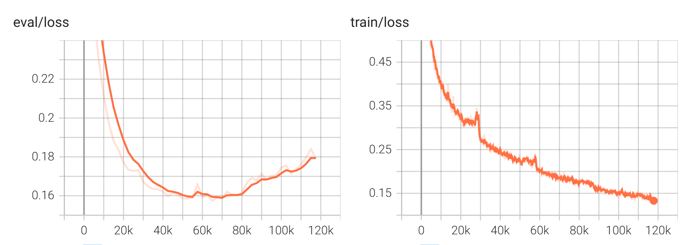

# Fine-tune Whisper


## Introduction

OpenAI open-sourced project Whisper, which claims to have human-level speech recognition in English, and it also supports automatic speech recognition in 98 other languages. Whisper provides automatic speech recognition and translation tasks. They can turn speech into text in various languages and translate that text into English.

This recipe means to fine-tune Whisper more conveniently. It is modified from project: [Whisper-Finetune](https://github.com/yeyupiaoling/Whisper-Finetune). Please refer to it for more details of original data format training and deployments speeding up. OpenAI currently open source for several models, specific can view [openai](https://huggingface.co/openai), the following is a list of commonly used model ids.

<details>
<summary><strong>Model ids</strong></summary>

- openai/whisper-tiny
- openai/whisper-base
- openai/whisper-small
- openai/whisper-medium
- openai/whisper-large
- openai/whisper-large-v2
- openai/whisper-large-v3

</details>
<details>
<summary><strong>Environments</strong></summary>

- Anaconda 3
- Python 3.8
- Pytorch 1.13.1
- egrecho
- Linux
</details>

**Highlights**:
- [x]  [Lhotse](https://github.com/lhotse-speech/lhotse) dataset
- [x]  Full/lora tune
- [x]  [Transformers](https://github.com/huggingface/transformers) trainer
- [x]  Multi-GPU traning based on accelerate, including DDP and deepspeed zero
- [x]  Multilingual training
- [ ]  New language fine-tune
- [ ]  ONNX export


## Contents

- [Fine-tune Whisper](#fine-tune-whisper)
  - [Introduction](#introduction)
  - [Contents](#contents)
  - [Installation](#installation)
  - [Main programs](#main-programs)
  - [Prepare data](#prepare-data)
  - [Finetune model](#finetune-model)
  - [Results](#results)
  - [Reference](#reference)
  - [Tutorial large model training](#tutorial-large-model-training)


<span id='Installation'></span>
## Installation
We assume you have already installed cuda PyTorch and Egrecho. Next, you should install additional requirements specified in the ``requirements.txt`` file provided by this recipe if necessary.

<span id='maincodes'></span>
## Main programs

+ **local**: Holds some local scripts, like data preparation.
+ **egrecho_inner**: Inner local python package, contains codes for training/evaluation.
+ **config**: json/yaml configuration files

<span id='prepdata'></span>
## Prepare data
[lhotse](https://github.com/lhotse-speech/lhotse) is a excellent project for speech-related data preparation. At last, the data format should be as jsonlines, meaning that each line is a JSON data.

Here provides ``prepare.sh`` to prepare data from a kaldi style data directory:
```txt
./train/
├── utt2lang
├── text
└── wav.scp
```
``prepare.sh`` will prepare manifests and extract offline features if necessary. Suppose that we are going to fine-tune Vietnamese with offline feature, at last we will get:
```bash
# manifests
data/manifests/
├── aishell_vi_recordings_test.jsonl
├── aishell_vi_recordings_train.jsonl
├── aishell_vi_recordings_val.jsonl
├── aishell_vi_supervisions_test.jsonl
├── aishell_vi_supervisions_train.jsonl
├── aishell_vi_supervisions_val.jsonl
├── musan_recordings_music.jsonl.gz
├── musan_recordings_noise.jsonl.gz
├── musan_recordings_speech.jsonl.gz
└── musan_supervisions_music.jsonl.gz

# cutset manifests
data/fbank_whisper80/
├── aishell_vi_cuts_test.jsonl.gz
├── aishell_vi_cuts_train.jsonl.gz
├── aishell_vi_cuts_val.jsonl.gz
├── aishell_vi_feats_test
├── aishell_vi_feats_train
├── aishell_vi_feats_val
├── musan_cuts.jsonl.gz
└── musan_feats
```

```shell
zcat data/fbank_whisper80/aishell_vi_cuts_train.jsonl.gz | head -n 1
```
jsonlines format will be:
```python
{"id": "V0001W0001-0", "start": 0, "duration": 6.058625, "channel": 0, "supervisions": [{"id": "V0001W0001", "recording_id": "V0001W0001", "start": 0.0, "duration": 6.058625, "channel": 0, "text": "Sự xuất hiện của phiên bản hybrid sẽ giúp củng cố vị thế của Toyota trong phân khúc sedan cỡ D tại Việt Nam.", "language": "vi"}], "features": {"type": "whisper-fbank", "num_frames": 606, "num_features": 80, "frame_shift": 0.01, "sampling_rate": 16000, "start": 0, "duration": 6.058625, "storage_type": "lilcom_chunky", "storage_path": "data/fbank_whisper80/aishell_vi_feats_train/feats-0.lca", "storage_key": "0,25840,5691", "channels": 0}, "recording": {"id": "V0001W0001", "sources": [{"type": "file", "channels": [0], "source": "/work3/aishell-yuenan/AISHELL-ASR0071/SPEECHDATA/V0001/V0001W0001.wav"}], "sampling_rate": 16000, "num_samples": 96938, "duration": 6.058625, "channel_ids": [0]}, "type": "MonoCut"}
```
Lets check the statics of dataset:
```shell
./local/display_manifests.py data/fbank_whisper80/aishell_vi_cuts_train.jsonl.gz
```
```txt
╒═══════════════════════════╤════════════╕
│ Cuts count:               │ 928434     │
├───────────────────────────┼────────────┤
│ Total duration (hh:mm:ss) │ 1474:29:34 │
├───────────────────────────┼────────────┤
│ mean                      │ 5.7        │
├───────────────────────────┼────────────┤
│ std                       │ 2.0        │
├───────────────────────────┼────────────┤
│ min                       │ 0.1        │
├───────────────────────────┼────────────┤
│ 25%                       │ 4.3        │
├───────────────────────────┼────────────┤
│ 50%                       │ 5.6        │
├───────────────────────────┼────────────┤
│ 75%                       │ 7.0        │
├───────────────────────────┼────────────┤
│ 99%                       │ 10.8       │
├───────────────────────────┼────────────┤
│ 99.5%                     │ 11.5       │
├───────────────────────────┼────────────┤
│ 99.9%                     │ 13.3       │
├───────────────────────────┼────────────┤
│ max                       │ 44.0       │
╘═══════════════════════════╧════════════╛
```
> **Note**: Actually the above data has been 3-fold speed perturb, which means the real total duration is about 488.20 hours. Some experiments turns out that speed perturb is dispensiable, So it could be turned down to save storage.


<span id='Finetune'></span>
## Finetune model

We are ready to fine-tune our model. In ``finetune.sh``, ``--stage 0 --stop_stage 0`` is training and ``--stage 1 --stop_stage 1``is evaluation. you can choose ``--model_name`` and ``--is_lora`` to change the mode.
> **Tip**: Use ``hf_download.sh`` to manually download pretrained model to local space.

The related python scripts are in ``egrecho_inner``:
+ lora.py: Lora fine-tune.
+ merge_lora.py: After lora fine-tuning, there will be two models, the first is the Whisper base model, and the second is the Lora model. This script merges these two.
+ full.py: Full-parameter fine-tune.
+ evaluation: wer/cer metric.

Type ``egrecho_inner/lora.py -h`` to get detail arguments information. Multi-GPU training scripts is launched by accelerate, so they are not registed by cli usage like:
```bash
egrecho merge-lora-whisper -h
```
It is recommended to use configuration yaml to better control your experiments：``egrecho eval -c=config/eval.yaml [overwrite opts]``. Alternatively, User can type ``egrecho eval --print_config > raw_eval.yaml`` to get a raw yaml to revise.

Before training, let's test the original model:

```shell
egrecho eval -c config/eval.yaml \
  --model_path openai/whisper-small \
  --outdir exp/whisper-small/orig

```
The wer on test set, which have 4096 samples, counts to about 6.5 hours is:
```python
{
  "error_rate": 0.39612,
  "ins_rate": 0.16363,
  "del_rate": 0.00594,
  "sub_rate": 0.22655,
  "total": 75424,
  "RTF": 0.11016
}
```
We are about to full fine-tune about 3 epochs with 2 * v100 gpus, totally couts to about 3*3 (speeds) epochs:
```shell
# This takes about 24 hours
bash finetune.sh --is_lora false
```
log start with:
```python
{'loss': 3.2523, 'grad_norm': 14.147368431091309, 'learning_rate': 9.5000000000000016, 'epoch': 0.0}
{'loss': 1.8981, 'grad_norm': 9.693570137023926, 'learning_rate': 1.93e-06, 'epoch': 0
.0}
{'loss': 1.5866, 'grad_norm': 12.419870376586914, 'learning_rate': 2.91e-06, 'epoch': 0.0}
{'loss': 1.2263, 'grad_norm': 8.078407287597656, 'learning_rate': 3.910000000000001e-06, 'epoch': 0.0}
{'loss': 1.0582, 'grad_norm': 6.896629333496094, 'learning_rate': 4.9100000000000004e-06, 'epoch': 0.0}
{'loss': 0.9085, 'grad_norm': 7.505342960357666, 'learning_rate': 5.9e-06, 'epoch': 0.0}
```
log end with:
```python
{'loss': 0.1524, 'grad_norm': 3.184204578399658, 'learning_rate': 1e-05, 'epoch': 3.06
}
{'loss': 0.1594, 'grad_norm': 3.1745033264160156, 'learning_rate': 1e-05, 'epoch': 3.0
6}
{'loss': 0.1484, 'grad_norm': 2.7085471153259277, 'learning_rate': 1e-05, 'epoch': 3.0
6}
{'eval_loss': 0.1744384765625, 'eval_runtime': 8.8203, 'eval_samples_per_second': 58.0
48, 'eval_steps_per_second': 1.814, 'epoch': 3.06}
```
Tensorboard loss curve:

and evaluation results:
```python
{
  "error_rate": 0.04042,
  "ins_rate": 0.00447,
  "del_rate": 0.00294,
  "sub_rate": 0.03301,
  "total": 75424,
  "RTF": 0.07624
}
```

Well done! whisper-small has been successfully fine-tuned.


<span id='results'></span>
## Results

  | model | params | original | WER (ins, des, sub) |
  | :----- | :-----: | :--------: | :------- |
  | medium-full| 769M   | 17.04    | **3.23** (0.38, 0.27, 2.57)   |
  | medium-lora| -   | -    | 3.94 (0.51, 0.33, 3.10)   |
  | medium-lion-lora| -  | -    | 9.23 (2.01, 0.30, 6.92)  |
  | small-full | 244M   | 39.61    | **4.04** (0.44, 0.29, 3.30)  |
  | small-lora| - | -    | 6.58 (1.05, 0.47, 5.05)  |
  | small-full (freeze-enc)| -  | -   | 13.60 (5.41, 0.51, 7.68)  |


*Conducted by Dexin Liao (2024-06)*
> **Note**:
> 1. Fine-tuning does not include timestamp information for now.
> 2. A training waveform shorter than 30s will be padded to a fixed 30s as original whisper, while a longer one will be discarded.
> 3. The training data uses data with punctuation marks, resulting in a slightly higher error rate.


<span id='ref'></span>
## Reference

1. https://github.com/yeyupiaoling/Whisper-Finetune
2. https://github.com/huggingface/peft
3. https://github.com/k2-fsa/icefall/tree/master/egs/aishell/ASR/whisper
4. https://github.com/openai/whisper


## Tutorial large model training
Please refer to [here](tutorial_LM_train.md)
