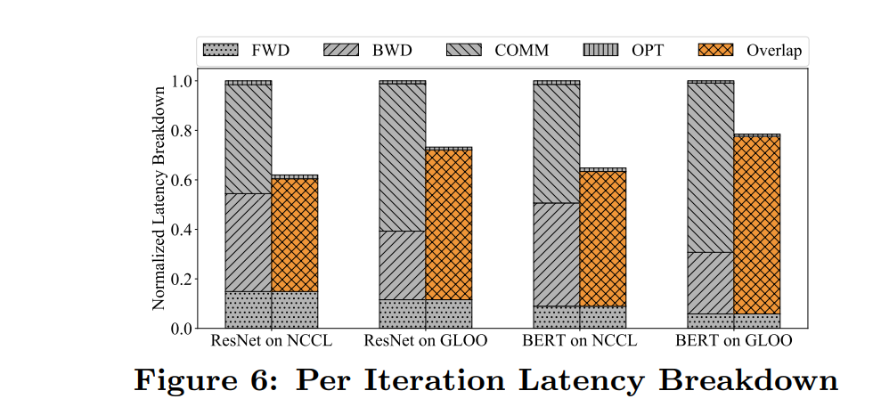
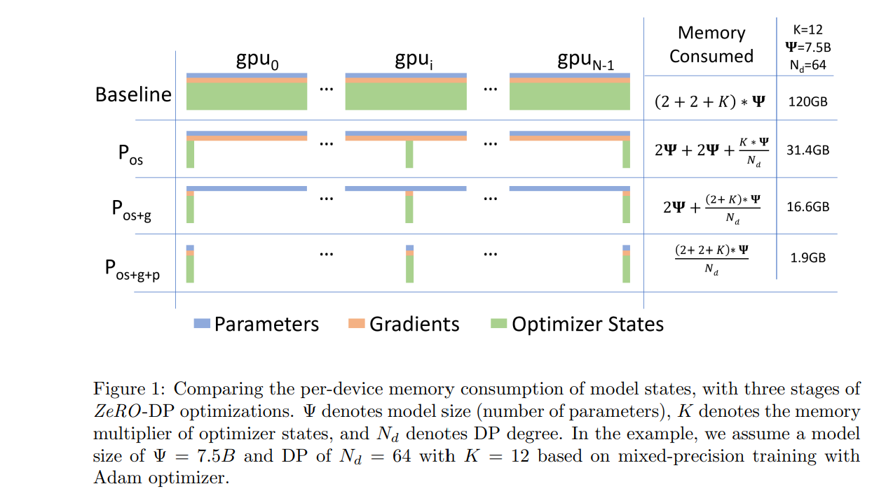
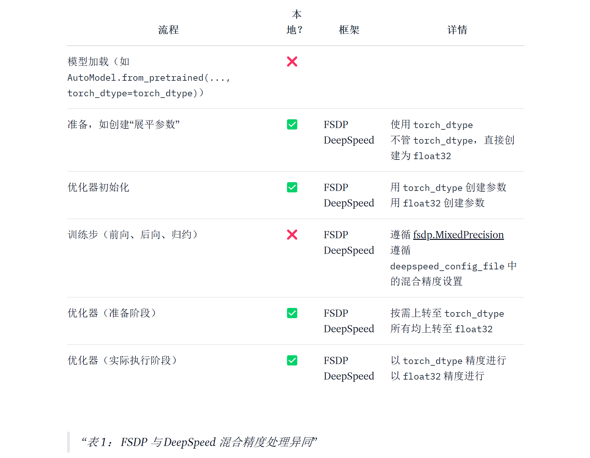

# 大模型训练工程笔记
*By 廖德欣 2024-06*
## 目录
- [大模型训练工程笔记](#大模型训练工程笔记)
  - [目录](#目录)
  - [模型参数](#模型参数)
      - [多头注意力块](#多头注意力块)
      - [MLP层](#mlp层)
  - [前向传播](#前向传播)
  - [反向传播](#反向传播)
  - [优化器参数](#优化器参数)
  - [Deepspeed Zero](#deepspeed-zero)
      - [混合精度训练](#混合精度训练)
      - [Stage1: 对优化器状态分片](#stage1-对优化器状态分片)
      - [Stage2: 对优化器状态，梯度分片](#stage2-对优化器状态梯度分片)
      - [Stage3: 对优化器状态，梯度、模型分片：](#stage3-对优化器状态梯度模型分片)
  - [模型并行](#模型并行)
  - [推理优化](#推理优化)
  - [实践分析](#实践分析)


大模型训练下，显存占比主要由模型参数、激活值、优化器参数构成。我们从模型参数计算开始。
## 模型参数
当网络深度足够时，主要参数由重复的transformer block组成。我们从一个简单的单独的transformer block入手，快速回顾transformer的参数构成。
隐层维度记作 $h$, 多头数量 $head\_num$ 记作 $n$。

#### 多头注意力块
其中多头是由计算中对特征空间切分实现的，与参数量无关
1. norm: $2h$，以普通layernorm为例
2. $Q,K,V$ 线性变化：$3*(h^2 + h)$
3. 注意力完成后输出映射: $h^2+h$

#### MLP层

1. 两层线形层，特征维度放大后激活函数再缩小为原维度：$4h^2+4h+4h^2+h=8h^2+5h$
2. norm: $2h$
    |idx  | name      | 参数量 (int8)             |
    | --- | -----     | --------                  |
    | 1   | norm      | $2h$                    |
    | 2   | atte      | $3h^2 + 3h$            |
    | 3   | atte out  | $h^2 +   h$            |
    | 4   | mlp       | $8h^2+5h$             |
    | 5   | norm      | $2h$                  |
    | all | -      | $12h^2+13h\approx 12h^2$|
可见标准transformer参数量基本上由两个关键参数确定：层数 $l$ 与隐层维度 $h$ 确定。

主流显存优化方案：
- **megatron**的模型并行，不同卡对模块层进行分片。
- **量化载入**: 如qlora，以4bit量化载入模型状态，实际训练过程为混合精度。

## 前向传播
激活值与batch size ($b$)，序列长度($s$)强相关,  隐藏层维度($h$)与模型相关，假设纯transformer结构(atte+mlp)，注意力多头数量 $head\_{num}$ 记作 $n$ 对其缓存(激活值)及计算量(矩阵乘法包括一次相乘与一次相加 $(m,n),(n,s)$ 将产生 $2*m*n*s$ 计算量)分析，**attention block**如下:
```math
Q = xW_Q,  K = xW_K,  V = xW_V

```
```math
X_{out} = {softmax(QK^T) \over \sqrt{h}} \cdot V \cdot W_o +x
```

1. 计算Q/K/V输入x：$[b,s,h]*[h,h]$,缓存输入 $bsh$，与序列长度/批大小线性相关，计算量 $3*2bsh^2$。

2. $QK^T$：$[b,n,s,h/n]*[b,n,h/n,s] \rightarrow [b,n,s,s]$ 输入保存q/k两个向量 $2bsh$，计算量 $2bs^2h$。

3. $score \cdot V$: $[b,n,s,s]*[b,n,s,h/n]$ 缓存包括score之前的qk: $bs^2*n$，score: $bs^2*n$，mask: $bs^2*n$，其中mask用int8表示，公式中对其做标记。V为 $bsh$，共 $2bs^2*n+[mask]bs^2*n+bsh$, 计算量为$2bs^2h$

4. 最后的隐层映射：$[b,s,h]*[h,h]$，缓存为上一步计算结果及dropout的mask $bsh+[mask]bsh$，计算量为$2bsh^2$

综上，**注意力模块**共计激活值 $5bsh+[mask]bsh+2bs^2n+[mask]bs^2n$，计算量 $4bs^2h+8bsh^2$。**MLP**层:
```math
Q =f_{gelu}(x_{out}W_1)W_2 + x_{out}
```
* 两个线性层：$[b,s,h]*[h,4h] \rightarrow [b,n,4h] $，$[b,s,4h]*[4h,h] \rightarrow [b,n,h]$，激活值包括第一个线性层：$bsh$,激活函数对4倍放大的隐层：$4bsh$，第二线性层输入：$4bsh$，dropout mask：$[mask]bsh$，共计 $9bsh+[mask]bsh$，计算量 $2*2*4bsh^2=16bsh^5$。

* 最后还有两层NORM层有激活值 $2*bsh$，注意：norm的flops量级相对较小，这里不计入计算量，但是在实际上其计算时间不可忽略，可能原因是因为norm操作是在32位上进行，此外norm操作涉及到的归约以及开方比加/减/乘慢很多。让我们用表格记录以上的总结：

    |idx  | name             | 激活值 (int8) | 计算量 (flops) |
    | --- | -----            | -------- | ------ |
    | 1   | norm             | $bsh$        | -      |
    | 2   | Q/K/V            | $bsh$       | $3*2bsh^2$ |
    | 3   | $QK^T$        | $2bsh$        | $2bs^2h$ |
    | 4   |$score \cdot V$ | $2bs^2*n+[mask]bs^2*n+bsh$ | $2bs^2h$ |
    | 5   |$h \cdot W_o$  |$bsh+[mask]bsh$ | $2bsh^2$ |
    | -   |注意力层统计      | $5bsh+[mask]bsh+2bs^2n+[mask]bs^2n$ |$4bs^2h+8bsh^2$ |
    | 6   |$f_{gelu}(x_{out}W_1)W_2 + x_{out}$ |$9bsh+[mask]bsh$ |$2*2*4bsh^2=16bsh^2$ |
    | 7   |norm              | $bsh$|- |
    | -   |norm层统计        | $2bsh$ |- |
    | all |标准transformer block  | $16bsh+[mask]2bsh+2bs^2n+[mask]bs^2n$ |$4bs^2h+24bsh^2$ |

我们进一步总结：
- 激活值：分为 $\bold{bsh}$ 与 $\bold{nbs^2}$
    * $\bold{bsh}$: 线性复杂度，输入对应1，qkv对应3，输出映射1，mlp输入1，内部8，共计**14**，加上norm 2 为**16**。此外两次dropout线性复杂度mask $[mask]2bsh$。
    * $\bold{nbs^2}$：二次复杂度，原始 $QK^T$ 及softmax后共计**2**，此外一个注意力分数mask $[mask]nbs^2$。
- 计算量：分为 $\bold{bsh^2}$ 与 $\bold{bs^2h}$
    * $\bold{bsh^2}$: 线性复杂度，qkv对应3，输出映射1，mlp对应8，共计**12**，矩阵运算2系数共计**24**.
    * $\bold{bs^2h}$：二次复杂度，计算注意力分数以及全局注意力映射对应2，矩阵运算2系数共计**4**.
- 激活值占用显存与batch_size为严格线性关系

## 反向传播
以上是前向传播的分析，下面对**反向传播**分析[Ref link](https://zhuanlan.zhihu.com/p/675517271):


上图表示一次训练迭代中各个环节（前向传递、后向传递、通信环节、优化器更新）的耗时占比，来自于《PyTorch Distributed: Experiences on Accelerating Data Parallel Training》。可以看到，优化器更新忽略不计，反向传播大约是前向的两倍:
- 反向传播目的是计算参数对应的梯度，用以进行更新模型。我们在这里不进行深入的细节分析，总的来说，对权重的梯度计算依赖链式求导，在其中涉及的变量有模型参数以及激活值。对于参数的求导需要一次矩阵运算，然而，如果需要链式进行梯度传递，则需要对激活值进行求导，因此计算量大约为前向时的两倍。
- 反向传播计算的梯度，占用显存为模型参数量

浅谈针对前向/后向的大模型训练的优化方案：
- **混合精度fp16/bfp16**：主要目的是通过将默认32位降为16位进行计算加速，同时减小激活值占用显存。但是，由于精度问题，需要32位参数备份进行参数更新，因此不能说一定会更节省显存。在实践中，之前的主流asv任务为分类任务，可以认作是cv卷积任务，此时batch size一般会设置的比较大，模型也相对较小，这种情况下显存下降明显。在大模型的背景下，备份一个32位的模型显然会削弱混合精度的降显存效用，此时一般要对优化器参数进行其他优化如deepspeed的zero方案。
- **梯度检查点(gradient checkpoint)**: 由之前分析得知，在前向传播中，每个节点的激活值都会保存，而梯度检查点方案用时间换空间，采用部分式保存。反向传播时遇到空位激活值则通过保存的相邻值重新计算。大约用20%的时间代价(两次前向传播)，激活值显存占用从 $O(n)$ 到 $O(\sqrt{n})$。
- **megatron**：模型并行，不同卡对模块层进行分片，此时分布在单卡的激活值自然减少，同时会增加分布式的通信量
- **zero stage2**: 将梯度划分到多gpu中而不是每个gpu都存在一份。 关于[zero见下文](#deepspeed-zero)
- **flash attention**：对标准attention优化，降低内存并加速，效果显著但需要安培架构gpu，因此未对此进行实验。
- **架构改进**：以llama为例，rmsnorm减计算量，分组注意力GQA降低显存占用，减少计算量。

## 优化器参数
接下来我们以1B即1G参数模型进行优化器显存消耗分析，1G作为模型系数单位。优化器为ADAM，它需要保存一阶+二阶动量即两倍模型参数量。常见优化显存方案：
- deepspeed zero优化，此部分后续讨论
- bitsandbytes:
    - 8bit精度优化器
    - page optimizer, 若gpu峰值状态过高时，动态性地将optimizer状态转入CPU，可与8/4 bit optimizer配合减少数据转移压力

## Deepspeed Zero

相比于DDP，zero1、zero2并不会增加通信成本，而zero3增加参数通信量，速度换内存。此外，offload包括optimizer offload（通用）及param offload（stage3限定），用cpu空间换gpu空间，增加通信成本。
| Speed | mem efficient |
| --- | --- |
| ZeRO-1 | ZeRO-3 + offload |
| ZeRO-2 | ZeRO-3 |
| ZeRO-2 + offload | ZeRO-2 + offload |
|ZeRO-3  | ZeRO-2 |
| ZeRO-3 + offload | ZeRO-1 |

*下图来自微软[zero](https://arxiv.org/pdf/1910.02054)论文*：


理论上，只要有足够的卡与通信，zero3可以将所有状态参数稀释，网络中主要占比为激活值。
#### 混合精度训练

混合精度训练通常要保持高精度fp32的主权重备份，在优化器更新阶段采用高精度计算。
假设单卡状态下fp32训练，模型+优化器+梯度 $4*4=16G$，amp为：$2+3*4+2=16G$,可见保存的主参数增加量正好抵消了半精度的下降量。


*下表来自[huggingface](https://huggingface.co/blog/zh/deepspeed-to-fsdp-and-back)*



*“本地？”列说明了当前步骤是否是由各 GPU 本地执行的，如果是这样的话，那么上转的内存开销就可以分摊到各个 GPU。*

> **Note**: 假设amp训练在大量 GPU 上进行分片时，精度上转(fp16 -> fp32)对内存消耗的影响可能可以忽略不计。然而，当在少量 GPU 上使用 DeepSpeed 时，内存消耗会显著增加，高达 2 倍。

我们通过deepspeed控制文件参数对各个stage进行回顾分析：

#### Stage1: 对优化器状态分片
Stage1 为将优化器状态分布到各GPU上，参数表如下：


```python
{
    # 允许处理非deepspeed实现的优化器
    "zero_allow_untested_optimizer": true,
    # 混合精度梯度放缩范围相关
    "fp16": {
        "enabled": "auto",
        "loss_scale": 0, # 0 代表动态否则固定
        "loss_scale_window": 100,
        "initial_scale_power": 16,
        "hysteresis": 2,
        "min_loss_scale": 0.01
    },
    # bf16代替fp16，精度更高更为稳定
    "bf16": {
        "enabled": "auto"
      },
    # 不同gpu上优化器通信算法相关
    "zero_optimization": {
        "stage": 1,
        "allgather_partitions": true,
        "allgather_bucket_size": 2e8,
        "overlap_comm": true,
        "reduce_scatter": true,
        "reduce_bucket_size": 2e8,
        "offload_optimizer": {
          ...
        },
    },
    # 单gpu * gpu数量 * 梯度累积
    "train_batch_size": "auto",
    # 单gpu的batch_size
    "train_micro_batch_size_per_gpu": "auto",
    # 梯度累积
    "gradient_accumulation_steps": "auto",
    # 梯度裁剪
    "gradient_clipping": "auto",
    # log
    "steps_per_print": 100,
    # log latency
    "wall_clock_breakdown": false
}

```
* 当`overlap_comm`设置为true，deppspeed通过增加GPU内存使用来降低`allreduce`延迟。它使用了4.5倍于`allgather_bucket_size`和`reduce_bucket_size`。默认官方设置为`5e8`对应9GB的GPU内存（$5e8 * 2bytes * 2 * 4.5$）。如果富余GPU内存少于9G需要减少`bucket_size`，防止内存不足（OOM）。在这个配置里设为`2e8`对应的是3.6G。
* `allgather_bucket_size`和`reduce_bucket_size`的值越小，通信速度越慢，可用的GPU内存越多。可用来均衡GPU内存和通信速度。

#### Stage2: 对优化器状态，梯度分片
因为没有模型分片，因此与推理隔离，为主要使用模式。

- 原生ddp的梯度同步通信量系数为**2**，包括`reduce-scatter`+`all-gather`:先将数据散布到各个计算节点上，然后将这些分散的数据聚合起来。
- stage2 在一个 Layer 的 Gradient 都被计算出来后：Gradient 通过 ` scatter-reduce` 进行聚合。聚合后的梯度只会被某一个进程用来更新参数，立马释放掉其它进程上的这段 Gradient 实现切分，最后`all-gather`更新后的参数，总通信与ddp一致。


```python
{
    ...
    "zero_optimization": {
        "stage": 2,
        "offload_optimizer": {
            "device": "cpu|none",
            "pin_memory": true
        },
        ...
        "contiguous_gradients": true,  # 梯度地址连续化
        "round_robin_gradients": true  # stage2优化梯度cpu offload
    },
    ...
}

```
#### Stage3: 对优化器状态，梯度、模型分片：

模型分片的特性使其可用于推理大模型。

1. flatten原始参数，按照进程进行切分。
2. 前向传播/反向传播前，broadcast各部分模型参数，此时通信系数为2，加上梯度的`reduce-scatter`最终系数为**3**，原生ddp的1.5倍。

```python
{
    ...
    "zero_optimization": {
        "stage": 3,
        # 模型cpu offload
        "offload_param": {
            "device": "cpu|none",
            "pin_memory": true
        },
        ...
        "sub_group_size": 1e9,
        "reduce_bucket_size": "auto",
        "stage3_prefetch_bucket_size": "auto",
        "stage3_param_persistence_threshold": "auto",
        "stage3_max_live_parameters": 1e9,
        "stage3_max_reuse_distance": 1e9,
        "stage3_gather_16bit_weights_on_model_save": true
    },
    ...
}

```

- 效率相关
    * `stage3_max_live_parameters`: `max_live`为在任何给定时间需在 GPU 上保留多少个完整参数的上限。(增大可减小通信量)
    * `stage3_max_reuse_distance`：类似lru机制，`max_reuse_distance`用来确定参数的丢弃与保留，当开启gradient checkppoint时缓存前向计算重计算的值可以大大加快训练效率。这两个参数共享内存，在这里`1e9`为占用2G。
- 保存相关
    * `stage3_gather_16bit_weights_on_model_save`: 保存前收集各分片的16bit参数，耗时但是需打开以支持断点续训
- 模型隐层大小相关(transformers trainer 中建议'auto'，会自动找config中的hidden_size参数)：
    * `reduce_bucket_size`: $h*h$
    * `stage3_prefetch_bucket_size`: $0.9*h*h$
    * `stage3_param_persistence_threshold`：$10*h*h$,比这小的参数视作小参数不参与分片，以减轻通信压力
- 模型参数更新相关
    * `sub_group_size`: 参数依据该参数装桶，控制optimizer一次更新量。offload时可防止模型在参数更新时消耗过多cpu内存。
        1. 在`optimizer.step()`中OOM：减小 `sub_group_size`减少临时buffers的内存利用
        2. `optimizer.step()`花费很长时间: 增大`sub_group_size`增加数据buff提高带宽利用率

## 模型并行
TODO

## 推理优化
TODO
## 实践分析
